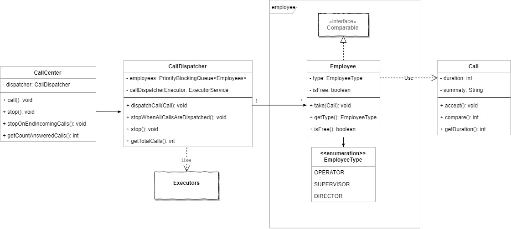

# CallCenter 
##### Tomás A. Bert
 
## Diagrama de Clases 
 
 
## Diseño 
 
Se pensó el diseño a partir de dos requerimientos que se consideraron importantes
- ".. una llamada telefónica en primera instancia debe ser atendida por un operador, si no hay ninguno libre debe ser atendida por un supervisor, y de no haber tampoco supervisores libres debe ser atendida por un director." 
 
- "La clase Dispatcher debe tener la capacidad de poder procesar 10 llamadas al mismo tiempo (de modo concurrente)." 
 
Para ambos requerimientos se optó por utilizar Executors y *PriorityBlockingQueue* dentro del *dispatcher*.
Por cada llamada que se despacha se hace ``submit`` en el ExecutorService, creando un nuevo hilo que toma desde la cola de prioridad un empleado (si no hay empleados, el hilo se bloeque hasta que haya uno). Una vez que se toma el empleado, se le asigna la llamada y luego se lo devuelve a la cola.

Respecto a la cola de prioridad, esta contiene empleados. El orden es definido por el tipo de empelado, por lo tanto, la clase **Employee** implementa la interface ``Comparable``. El orden de prioridad de los empleados es tal cual se especifica en el enunciado: primero los operados, luego los supervisores y por último los directores.

Se toma como requerimiento que el limitante de llamadas que se pueden despachar al mismo tiempo sean solo 10.

##### CallCenter 
Se implemento la clase **CallCenter** con el fin de abstraer en una capa la integración de todo el sistema. Esta se encarga de la construcción de todos los empleados (**EmployeesManager**) y el nivel jerárquicos. Además, instancia al **CallDispatcher** con sus parametros correspondientes. Con este nivel de abstracción se logra realizar pruebas de una forma mas sencilla de todo el sistema en conjunto y sus casos bordes. 
 
## Extras 

#### "Dar alguna solución sobre qué pasa con una llamada cuando entran más de 10 llamadas concurrentes." 
Cuando se crea el *executor service* se asigna como parametro cuantos hilos puede correr el mismo. Si la cantidad de llamadas a despachar simultaneamente es mas mayor a la cantidad de hilos disponible (cada llamada requiere un hilo), el Executor se encarga de encolar el hilo para que cuando finalizen la ejecucion de otro hilo (finalización de llamada) se ejecute el hilo que está a la espera.

#### "Dar alguna solución sobre qué pasa con una llamada cuando no hay ningún empleado libre."   
``PriorityBlockingQueue`` es una estructura de sincronización (concurrencia). Si un hilo hace ``take()`` y la cola está vacia, se bloquea hasta que haya un elemento, empleado en este caso.

#### Otros 
 
- Los test unitarios y de integración se encuentran en `src/test` 
- Se utiliza **Log4j** para poder hacer seguimientos por medio de un archivo de log o STDOUT. 
Se puede configurar desde `src/main/resources/log4j.properties`
