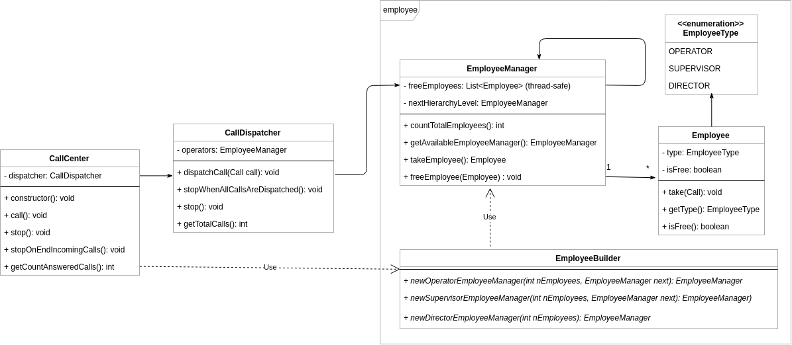

# CallCenter 
##### Tomás A. Bert
 
## Diagrama de Clases 
 
 
## Diseño 
 
Se pensó el diseño a partir de dos requerimientos que se consideraron importantes
- ".. una llamada telefónica en primera instancia debe ser atendida por un operador, si no hay ninguno libre debe ser atendida por un supervisor, y de no haber tampoco supervisores libres debe ser atendida por un director." 
 
- "La clase Dispatcher debe tener la capacidad de poder procesar 10 llamadas al mismo tiempo (de modo concurrente)." 
 
Respecto al primer requerimiento se optó por una solución basada en el patrón *"chain of responsability"* implementando la clase **EmployeeManager**. Esta clase contiene un conjunto de empleados del mismo tipo y a su vez una instancia a otro **EmployeeManager** para delegarle la responsabilidad en caso de que no haya empleados desocupados. Por lo tanto, el *dispatcher*, cuando debe despachar una llamada, teniendo como referencia el nivel jerárquico más bajo, busca a partir del mismo - iterando - algún nivel donde tenga al menos un empleado disponible. Una vez conseguido, toma el empleado y le asigna la llamada cumpliendo con el despacho. 
 
Para el segundo requerimiento, el enfoque de la solución debe ser concurrente. Esto quiere decir que se debe pensar que el acceso a los recursos debe ser seguro (*thread-safe*). Para ello se utilizan las [herramientas que nos provee Java 8](https://docs.oracle.com/javase/8/docs/technotes/guides/concurrency/index.html) tales como *synchronize*, *synchronizedList*, tipos atómicos, entre otros. 
La clase **CallDispatcher** se comporta como un servidor concurrente. Al momento de instanciarlo (`new CallDipatcher`) se crea un hilo que consume mensajes - dentro de un ciclo - desde una cola con prioridad bloqueante (`PriorityBlockingQueue`). Cuando se llama al metodo para despachar una llamada (`dispatchCall`) solo se introduce la llamada en la cola para que luego el hilo que esta consuminedo tome la llamada, crea un nuevo hilo para seleccionar al empleado al que se la asignará la llamada e inmediatamente sigue consumiendo de la cola.
Se toma como requerimiento que el limitante de llamadas que se pueden despachar al mismo tiempo sean solo 10.

##### CallCenter 
Se implemento la clase **CallCenter** con el fin de abstraer en una capa la integración de todo el sistema. Esta se encarga de la construcción de todos los empleados (**EmployeesManager**) y el nivel jerárquicos. Además, instancia al **CallDispatcher** con sus parametros correspondientes. Con este nivel de abstracción logra realizar probar de una forma mas sencilla todo el sistema en conjunto con sus casos bordes. 
 
## Extras 

#### "Dar alguna solución sobre qué pasa con una llamada cuando entran más de 10 llamadas concurrentes." 
La problemática citada se resuelve dentro del **CallDispatcher** insertando un semáforo al estilo productor-consumidor con *buffer*, donde inicialmente su valor (`permits`) se define con el parámetro de cuantas llamadas se pueden despachar simultaneamente, que es parte del contructor de la clase. Entonces, se hace `acquire` al semáforo previo a tomar un mensaje de la cola bloqueante y el `realease` posterior a que el mensaje se consuma, es decir, haya sido despachado y tomado por un empleado hasta su finalización. Por lo tanto, si ingresan mas de 10 (o el valor que se paso por parametro) llamadas simultaneas, el semaforo bloqueara el hilo que consume de la cola.

#### "Dar alguna solución sobre qué pasa con una llamada cuando no hay ningún empleado libre."   
Su utiliza el método de la solución al item anterior, donde el valor inicial del semaforo (`permits`), en este caso, es el mínimo entre la cantidad de empleados que hay en el CallCenter y el parámetro de la cantidad de llamadas en simultaneo permitidas. Este número es obtenido desde la instancia al **EmployeeManager** que se le provee al **CallDispatcher**

#### Otros 
 
- Los test unitarios y de integración se encuentran en `src/test` 
- Se utiliza **Log4j** para poder hacer seguimientos por medio de un archivo de log o STDOUT. 
Se puede configurar desde `src/main/resources/log4j.properties`
