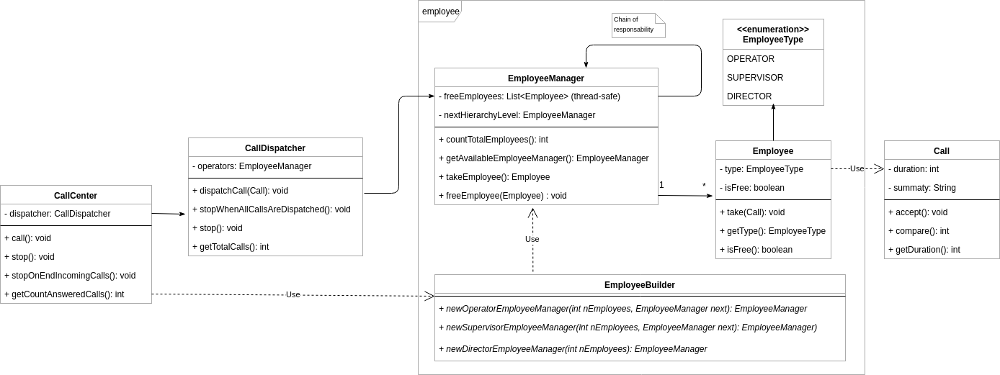

# CallCenter 
##### Tomás A. Bert
 
## Diagrama de Clases 
 
 
## Diseño 
 
Se pensó el diseño a partir de dos requerimientos que se consideraron importantes
- ".. una llamada telefónica en primera instancia debe ser atendida por un operador, si no hay ninguno libre debe ser atendida por un supervisor, y de no haber tampoco supervisores libres debe ser atendida por un director." 
 
- "La clase Dispatcher debe tener la capacidad de poder procesar 10 llamadas al mismo tiempo (de modo concurrente)." 
 
Respecto al primer requerimiento, se optó por una solución basada en el patrón *"chain of responsability"* implementando la clase EmployeeManager. Esta clase contiene un conjunto de empleados del mismo tipo y a su vez una instancia a otro **EmployeeManager** para delegarle la responsabilidad en caso de que no haya empleados desocupados. Por lo tanto, el *dispatcher* cuando debe despachar una llamada, teniendo como referencia el nivel jerárquico más bajo, busca a partir del mismo - iterando - algún nivel donde tenga al menos un empleado disponible. Una vez conseguido, toma el empleado y le asigna la llamada cumpliendo con el despacho. 
 
Para el segundo requerimiento, el enfoque de la solución debe ser concurrente. Esto quiere decir que se debe pensar que el acceso a los recursos debe ser seguro (*thread-safe*). Se utilizan las [herramientas que nos provee Java 8](https://docs.oracle.com/javase/8/docs/technotes/guides/concurrency/index.html) tales como *synchronize*, *synchronizedList*, tipos atómicos, entre otros. 
 
En relación a lo anteriormente explicitado podemos decir que el dispatcher se encarga de seleccionar al primer nivel jerárquico que tenga al menos un empleado desocupado, partiendo del nivel inferior.

##### CallCenter 
Se implemento la clase **CallCenter** con el fin de abstraer en una capa la integración de todo el sistema. Esta se carga de la construcción de todos los **EmployeesManager**, definiendo los niveles jerárquicos. Además, instancia al CallDispatcher utilizándolo concurrentemente por varios hilos. Con este nivel de abstracción logra realizar probar todo el sistema en conjunto con sus casos bordes. 
 
### Extras 
##### "Dar alguna solución sobre qué pasa con una llamada cuando no hay ningún empleado libre." 
CallCenter se comporta como un servidor concurrente. Al momento de hacer `start()` se crea un hilo que consume mensajes - dentro de un ciclo - desde una cola bloqueante. Cuando llega un mensaje, crea un nuevo hilo para despachar el mensaje (utilizando el *dispatcher*) e inmediatamente vuelve a consumir de la cola. 
  
En relación a la problemática citada, se resuelve insertando un semáforo al estilo productor-consumidor, donde inicialmente su valor (`permits`) es la cantidad de empleados en todo el CallCenter. Entonces, se hace `acquire` previo a tomar un mensaje de la cola bloqueante y el `realease` posterior a que el mensaje se consuma, es decir, haya sido despachado y tomado por un empleado hasta su finalización.

**Nota**: La implementación mencionada anteriormente puede estar dentro del *dispatcher*. Se opto por implementarlo en un nivel más alto para que haya una división de responsabilidades entre **CallCenter** y **CallDispatcher**.

##### Dar alguna solución sobre qué pasa con una llamada cuando entran más de 10 llamadas concurrentes. 
El diseño está pensado para que el metodo `dispatchCall` pueda ser llamado por *N* hilos. Por otro lado, dentro de la clase **CallCenter**, se utilizan **Executors** para la creación de hilos. La cantidad de hilos que puede tener el executor es parametrizable.

##### Otros 
 
- Los test unitarios y de integración se encuentran en `src/test` 
- Se utiliza **Log4j** para poder hacer seguimientos por medio de un archivo de log o STDOUT. 
Se puede configurar desde `src/main/resources/log4j.properties`
